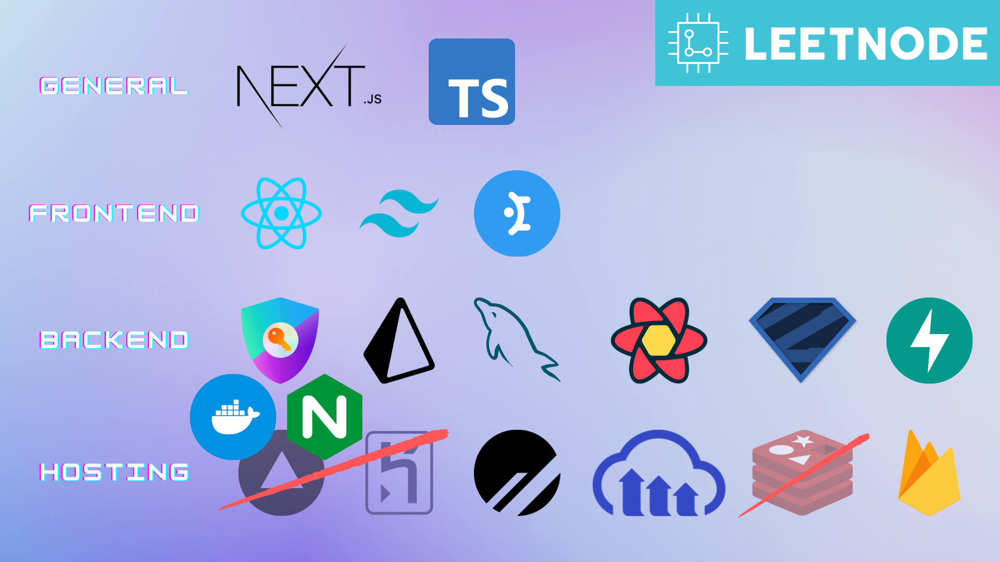
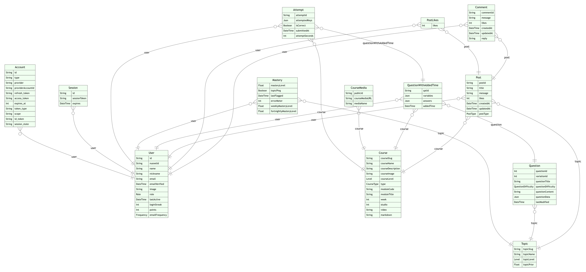

# LeetNode: An Adaptive Learning Software

## Overview (Original AY22/23 Capstone Description)

Every student learns at a different pace.  Some students may grasp concepts more easily, while others may require extra coaching and practice before they could grasp the concepts. The traditional teaching style typically provides a "one-size-fits-all" learning experience. It is usually targeted at the average student, which might bore the faster students, while leaving the slower students struggling to catch up. "Adaptive learning", on the other hand, addresses the needs of each student through real-time feedback, and adapts the teaching pace and content sequences accordingly. This approach usually provides better learning experiences and results.

Electrical circuit principles, which are taught in the freshmen year for both electrical and computer engineering programmes, are important foundational knowledge for several other modules. It is observed that students who do not have a good grasp of these principles tend to struggle in the subsequent modules. The objective of this capstone project is to develop an adaptive learning software that teaches electrical circuit principles, so as to help as many students as possible to grasp these important fundamental concepts.

The four students in this capstone project will jointly develop the software tool, consisting of the following key parts:

1. User interface
2. Backend server
3. Adaptive learning algorithm
4. Content development & automated question bank

The adaptive learning software tool has great potential for the following:

- Being adopted by modules in NUS that teach electrical circuit principles
- Being adopted in other local and international universities/high schools
- Commercialisation of adaptive learning platform

## Get Started with Docker

### Project Cloning

First, `git clone` this project onto your machine. Then, when you are working on the app itself, it is recommended to open the project in the `/LeetNode/leetnode` subfolder instead of the `/LeetNode` root folder as the relative paths might break. Just remember to `cd ..` back to the root folder when running `docker compose`.

```bash
git clone https://github.com/leehungtien/LeetNode_AY23-24.git
cd LeetNode_AY23-24  # root folder of this repo

cd leetnode  # subfolder for the NextJS app only
code .  # opens the /leetnode subfolder in VSCode
```

### Environment Variables

**! IMPORTANT:** Always ensure you have the most updated `.env` file from your team and place it in the `/LeetNode/leetnode` subfolder. You will also need a `serviceAccountKey.json` file in the `/LeetNode/recommender` subfolder for Firebase to work, which you can get from your team, or from your Firebase console under `Project Overview > Project settings > Service accounts` after you are added into the Firebase project.

You may also start from scratch by copying the `.env.example` file in the `/LeetNode/leetnode` subfolder and creating a new `.env` local file with the environment variables filled in.

If you are deploying on Vercel or other managed hosting services, remember to replicate them in Vercel's or the provider's environment variables section as well.

### Docker Setup

Using Docker to run the app while still developing on your own host machine is recommended because everyone on the team will be in the same environment with the same tools, although installing the dependencies and starting the app on your own machine works as well.

Note that using Docker to develop means you cannot use the PlanetScale CLI and Prisma Studio to manage your database and interactively view and edit your database's data. So it is up to personal and team preferences.

Start by installing Docker on your machine. The commands below are for Ubuntu / WSL machines from this [link](https://docs.docker.com/engine/install/ubuntu/). You can find the steps for other OS online.

#### Set Up Repository

```bash
for pkg in docker.io docker-doc docker-compose podman-docker containerd runc; do sudo apt-get remove $pkg; done
sudo apt-get update
sudo apt-get install ca-certificates curl gnupg
sudo install -m 0755 -d /etc/apt/keyrings
curl -fsSL https://download.docker.com/linux/ubuntu/gpg | sudo gpg --dearmor -o /etc/apt/keyrings/docker.gpg
sudo chmod a+r /etc/apt/keyrings/docker.gpg
echo \
  "deb [arch="$(dpkg --print-architecture)" signed-by=/etc/apt/keyrings/docker.gpg] https://download.docker.com/linux/ubuntu \
  "$(. /etc/os-release && echo "$VERSION_CODENAME")" stable" | \
  sudo tee /etc/apt/sources.list.d/docker.list > /dev/null
```

#### Install Docker and Allow Non-Root User Access

```bash
sudo apt-get update
sudo apt-get install docker-ce docker-ce-cli containerd.io docker-buildx-plugin docker-compose-plugin
sudo groupadd -f docker && sudo usermod -aG docker $USER && newgrp docker

# Verify Installation
docker run hello-world
```

### Production Mode

#### Server Setup

There are many ways to provision a server to self-host the Docker containers. Easiest way to get started is to setup a small instance on cloud providers like GCP/AWS/Azure (on free credits preferably), SSH into it, `git clone/pull` this repo, build and start the server using `docker compose`. Then, just get a free subdomain from [freedns](https://freedns.afraid.org/) and point it to the public static IP address of the instance, allowing the app to be accessible with the URL.

However, running on local servers is also viable. With a Raspberry Pi or Synology NAS, it follows the same concept as above where the main tool needed is Docker. Once Docker is setup, and you have the source code and env files in the hardware's disk, Docker should be able to handle everything else from there to deploy the app. At best some networking configs have to be setup for users to access the IP address of the server either through an internal address on VPN or the local wifi, or an external URL like one from freedns.

#### Deployment Steps

1. Provision server from online cloud providers or local hardware like Synology NAS / Raspberry Pi.
1. Find the public static IP address of the server and make sure the hardware allows SSH and has the SSH port 22 opened (no firewall blocking).
1. Setup an SSH key on your local machine.

    ```bash
    ssh-keygen
    ```

1. SSH into the server with your private SSH key (non-`.pub`).

    ```bash
    ssh -i ~/.ssh/id_rsa <username>@<server public IP>
    ```

1. Update packages in the server.

    ```bash
    sudo apt-get update && sudo apt-get upgrade
    ```

1. Install Docker for the server's OS and setup permissions to allow Docker to work for non-sudo users (refer above) and enable swap mode if the server has not enough RAM.
1. Git clone this repo.

    ```bash
    git clone https://github.com/zhermin/LeetNode
    ```

1. Navigate to the `/LeetNode` root folder and pull the latest changes, if any.

    ```bash
    cd LeetNode
    git pull
    ```

1. Build and start the app in the background using `docker compose`.

    ```bash
    docker compose --profile prod up -d --build --force-recreate
    ```

    - `docker compose`: Runs the multi-container setup specified by the `docker-compose.yml` file (preferred over the `docker-compose` command)
    - `--profile prod`: Runs the Docker Compose services with the "prod" profile
    - `up`: Spins up all the containers at once (use `docker compose down` to shut them down)
    - `-d`: Runs containers in the background
    - `--build`: Rebuilds containers without having to first run `docker compose down` if there are new changes after `git pull`
    - `--force-recreate`: Recreates containers forcefully in case changes were not detected

1. Get a DNS address and point it to the public IP address, example from freedns; might be different for intranet / VPN access.
1. If everything ran without errors, the app should be accessible on the URL or the IP address directly, if on the same network as the server.

### Development Mode

You can also run the 3 containers in development mode using the `dev` profile, which enables hot reloading for changes to be reflected instantly, speeding up development on your own machine.

```bash
docker compose --profile dev up --build --force-recreate
```

The app will then be accessible on [`http://localhost`](http://localhost) (no port needed). The recommender service will also be accessible on [`http://localhost/recommender/`](http://localhost/recommender/) and the auto-generated docs on [`http://localhost/recommender/docs`](http://localhost/recommender/docs).

## Potential Extensions

The team has managed to accomplish the core functionalities expected from this web application, and beyond. However, the application did not manage to reach the general user testing phase, and hence, unforeseen problems might crop up. Regardless, here are some possible high-level extensions to LeetNode apart from deploying on local servers and managing the public release.

- Further Gamification
  - Currently there exists some gamification elements such as a daily login and attempt streak (a little buggy, can be improved) and a points and leaderboards system. However, more can be done to entice users to continue using the platform and practise various concepts.
  - Generally, better UI/UX can also help retain users as they use the platform.
- Automated Monitoring and Logging
  - To properly manage and monitor a full release of the application, logs and monitoring solutions can be employed to help find and fix problems quicker and more reliably.
- Automated Tests, with CI/CD Pipeline Integration
  - Automated tests help ensure code correctness and more importantly avoid regression bugs (old things breaking after introducing new changes), enabling confidence to develop new features quickly.
  - Integration with a CI/CD pipeline further enhances automation, where the tests can be triggered upon code pushes, for example.
  - Some examples of tests in software applications are:
    - Unit Tests: Tests individual functions, components, APIs, etc.
    - Integration Tests: Tests interactions between APIs and dependencies
    - E2E Tests: Tests complete user flows as how a user would use the application
  - Sidenote: In TDD (Test-Driven Development), a software development practice, tests are written first before code is then implemented to pass those tests. This is a bit more advanced but do offer many benefits, especially when maintaining and improving an existing software.
- CI/CD Pipeline
  - Although the bulk of the production deployment is already scripted using Docker, deployment after pushing to GitHub currently requires manually pulling the new code and stopping/starting using docker compose after the dev SSH into the remote server.
- Recommender Improvements
  - Currently the recommender model is unoptimized due to lack of data and training. With real users testing and generating training data, the model can be further improved to predict students' masteries more accurately.
  - Other recommendation techniques can also be explored.
- MLOps
  - Currently it is not possible to add new topics to the BKT model as the ML model file is just a snapshot of the trained list of topics. In order to allow educators to add new topics, the model file has to be updated manually. This can instead be automated by setting up a self-sustaining MLOps system, which offers other benefits as well.
- Dynamic Question Editor Improvements
  - Currently the question builder for admins is good enough for most use-cases. However, further enhancements can be made, such as:
    - Complex Numbers Support: `math.js` supports it but integration is needed
    - Wrong Options Logic: Instead of just randomizing the wrong options to be +/- x% from the correct answer, incorrect math expressions can branch off from the correct expressions and give more realistic wrong options
    - Support for Other Question Types: Enable different types of questions such as fill-in-the-boxes, short-answer and long-answer questions could vary up the experience
- GPT/LLM
  - A learning assistant powered by LLMs can offer a unique edge to this educational product.
  - However, the baseline LLMs are generally subpar at math and is prone to hallucination.
  - Techniques such as few-shot prompting, vector databases and ReAct/LangChain to introduce chain-of-thought reasoning and agents can further improve the reliability and functionality of the assistant.
  - This can also be used to help generate more questions potentially.
- Container Orchestration and Further Self-Hosting
  - Currently just deploying with `docker compose` will only instantiate 1 set of containers. However, if user traffic ever scales immensely, orchestration tools such as Kubernetes and Docker Swarm can help automated scaling and management.
  - If the free tiers of the storage solutions from PlanetScale, Cloudinary, Upstash and Firebase ever exceeds, self-hosting can be considered, although care has to be taken to ensure data is not lost if problems occur to the servers.

## Tech Stack (Reference: [T3-Stack](https://create.t3.gg/))

### Learning the Stack

All the technologies used can be overwhelming. However, start by trying to setup **Docker** and running the app locally on your machine first if possible so that you can see changes live. For example, by changing the source code of the Homepage's title.

The most important tool would be **NextJS**, which will also require some ReactJS understanding to at least change the frontend. **JavaScript** (TypeScript is just a stricter version) is then critical for the backend work.

All of the backend authentication, databases, hosting and infrastructure should work as is but will need further reading up on their docs or watching online tutorials if you wish to modify anything.

### Source Code

The code and detailed documentation for the main app, the LeetNode website, can be found in this repo in the subfolder [`/leetnode`](./leetnode).

Likewise, the code and docs for the recommender microservice can be found in the other subfolder [`/recommender`](./recommender). Originally, this was hosted on Heroku; but since Heroku only offers a 1 year free trial, moving forward, this will be self-hosted alongside the main app using Docker and Nginx.

### Stack Overview



The technologies listed below follow the order of the diagram above from top to bottom, left to right, except for the ones used for the recommender service.

#### General

- NextJS: "Full-Stack" Framework
- TypeScript: Statically-Typed Superset of the JavaScript Programming Language

#### Frontend

- ReactJS: Frontend Framework
- Tailwind CSS: Inline Styling
- Mantine Component Library: React UI Components

#### Backend

- NextAuth: Authentication and Authorization
- Prisma ORM: Abstration from SQL with Database
- MySQL: Relational Database
- React Query: Data Fetching/Caching/Mutation and State Management
- Zod: Type Validator

#### Hosting

- ~~Vercel: Website~~ (Still running but main method should be self-hosting)
- Docker: Containerization of the NextJS main app, FastAPI Recommender service and Nginx web server
- Nginx: Web Server and to manage both NextJS and FastAPI in the Docker network
- PlanetScale: MySQL Database
- Cloudinary: Media Database (Images, PDFs, etc.)

#### Recommender Microservice

- ~~Heroku: Hosts the Service~~ (Self-hosted with Docker + Nginx)
- ~~Redis: KV Store~~ (Not needed as getting model from Firebase is fast enough)
- FastAPI: REST API Endpoints for ML Model
- Firebase: Storage of ML Model in Pickle Format
- pyBKT: Statistical Machine Learning Model

#### Miscellaneous

- YouTube: Video Database (Lecture Videos)
- Mermaid & Draw.io: Schema Design
- Figma: UI/UX Design
- GitHub Actions: Cron Jobs for Auto-Sending Emails

## Schema Design (In Mermaid, Auto-Generated with [Prisma 👉 ER Diagram](https://prisma-erd.simonknott.de))



## The Team (2022-2023)

- [Zac Zher Min (Lead)](https://www.linkedin.com/in/zactamzhermin/)
- [Mingzhe](https://www.linkedin.com/in/mingzhe-wang/)
- [Jasmine](https://www.linkedin.com/in/lxyj/)
- [Angelina](https://www.linkedin.com/in/angelina-grace/)
