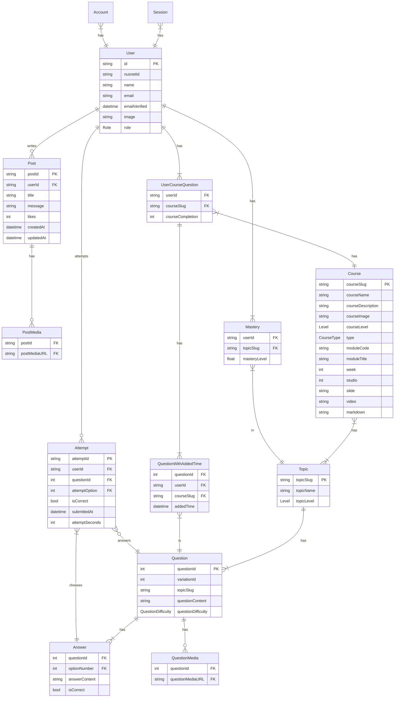

# LeetNode: An Adaptive Learning Software

## Overview

Every student learns at a different pace.  Some students may grasp concepts more easily, while others may require extra coaching and practice before they could grasp the concepts. The traditional teaching style typically provides a "one-size-fits-all" learning experience. It is usually targeted at the average student, which might bore the faster students, while leaving the slower students struggling to catch up. "Adaptive learning", on the other hand, addresses the needs of each student through real-time feedback, and adapts the teaching pace and content sequences accordingly. This approach usually provides better learning experiences and results.

Electrical circuit principles, which are taught in the freshmen year for both electrical and computer engineering programmes, are important foundational knowledge for several other modules. It is observed that students who do not have a good grasp of these principles tend to struggle in the subsequent modules. The objective of this capstone project is to develop an adaptive learning software that teaches electrical circuit principles, so as to help as many students as possible to grasp these important fundamental concepts.

The four students in this capstone project will jointly develop the software tool, consisting of the following key parts:

1. User interface
2. Backend server
3. Adaptive learning algorithm
4. Content development & automated question bank

The adaptive learning software tool has great potential for the following:

- Being adopted by modules in NUS that teach electrical circuit principles
- Being adopted in other local and international universities/high schools
- Commercialisation of adaptive learning platform

## Tech Stack (Reference: T3-Stack)

### Frontend

- NextJS (ReactJS)
- Tailwind CSS
- Mantine Component Library

### Backend

- TypeScript
- Routing, REST API, etc.: NextJS
- React Query
- Zod

### Database

- Relational DB: MySQL
- ORM: Prisma

### Authentication

- NextAuth

### Recommender Microservice

- Machine Learning: pyBKT
- FastAPI
- Docker

### Hosting

- Web: Vercel
- Database: PlanetScale
- Media: Cloudinary
- Recommender Microservice: Heroku
- Recommender Pickle Models: Firebase

### Miscellaneous

- Schema Design: Mermaid & Draw.io
- UI/UX Design: Figma
- Project Management: Notion

## Schema Design (Made with Mermaid)

## UI/UX Design

[Figma Mockup](https://www.figma.com/proto/Alagss66v74gG2fi8MjP7C/UIUX?node-id=12%3A6&scaling=scale-down&page-id=0%3A1&starting-point-node-id=12%3A6 "LeetNode's Figma Mockup")

## The Team

- [Zac Zher Min](https://www.linkedin.com/in/tamzhermin/)
- [Mingzhe](#)
- [Jasmine](#)
- [Angelina](#)
